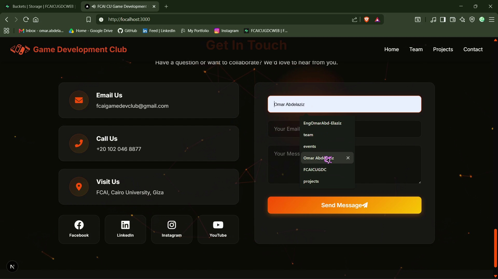
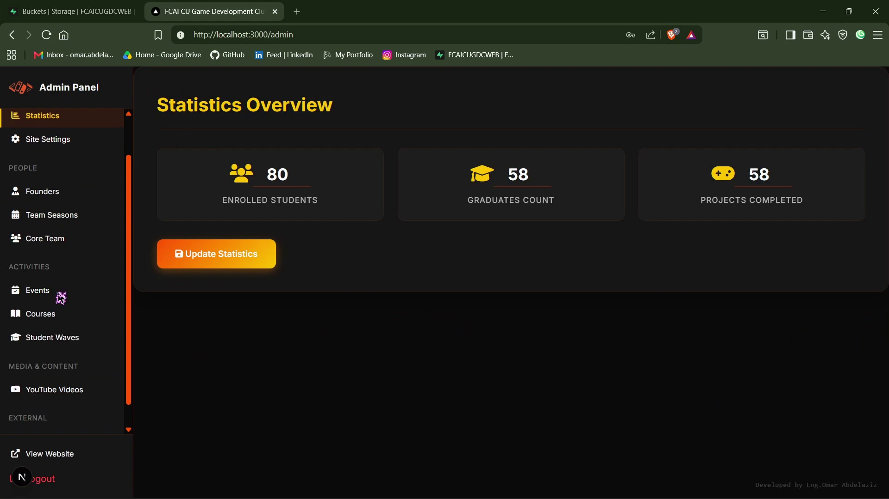
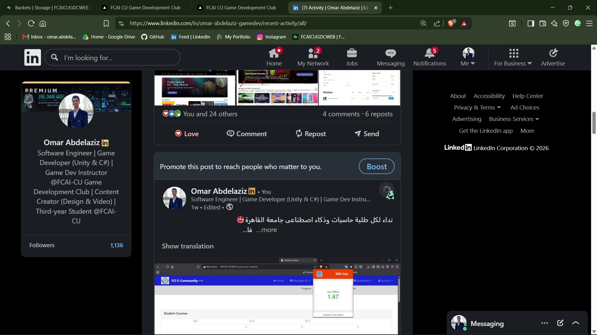

# 🎓 FCAI-CU Google Developer Groups (GDG) Website 🌐

Welcome to the official repository for the **FCAI-CU GDG** (Google Developer Groups at the Faculty of Computers and Artificial Intelligence, Cairo University) website. This platform serves as a central hub for our community, showcasing our events, projects, core team members, and providing a way to connect with us!

## 📸 Screenshots







## ✨ Features

- **Modern & Responsive Design**: Built to look great on all devices (mobile, tablet, desktop).
- **Interactive UI**: Seamless animations and transitions using Next.js.
- **Backend Integration**: Secure data handling and authentication powered by Supabase.
- **Email Notifications**: Integrated email services via Nodemailer for contact forms and subscriptions.

## 🛠️ Tech Stack

- **Framework**: [Next.js](https://nextjs.org/) (App Router)
- **Language**: [TypeScript](https://www.typescriptlang.org/)
- **Backend/Database**: [Supabase](https://supabase.com/)
- **Email Services**: [Nodemailer](https://nodemailer.com/)

## 🚀 Getting Started

Follow these steps to set up the project locally.

### Prerequisites

- Node.js (v18 or higher recommended)
- npm, yarn, or pnpm

### Installation

1. Clone the repository:
   ```bash
   git clone <repository-url>
   ```

2. Navigate to the project directory:
   ```bash
   cd fcai-cugd-club-web
   ```

3. Install dependencies:
   ```bash
   npm install
   ```

4. Configure Environment Variables:
   Ensure you have a `.env.local` file in the root directory. You will need variables for Supabase and Nodemailer (e.g., SMTP details).

5. Start the development server:
   ```bash
   npm run dev
   ```

6. Open [http://localhost:3000](http://localhost:3000) in your browser to view the application.

## 📁 Project Structure

- `app/`: Next.js App Router containing pages and API routes.
- `components/`: Reusable React components.
- `public/`: Static assets including images, icons, and screenshots.
- `lib/`: Utility functions and configuration files.
- `supabase/`: Supabase configurations.

## 🤝 Contributing

We welcome contributions from the community! If you'd like to help improve the website, please fork the repository and create a pull request with your changes. 
