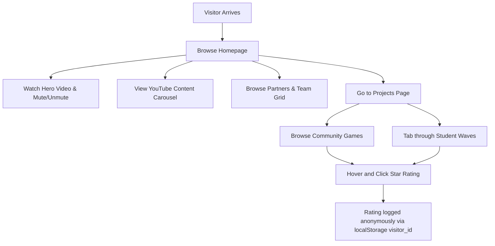
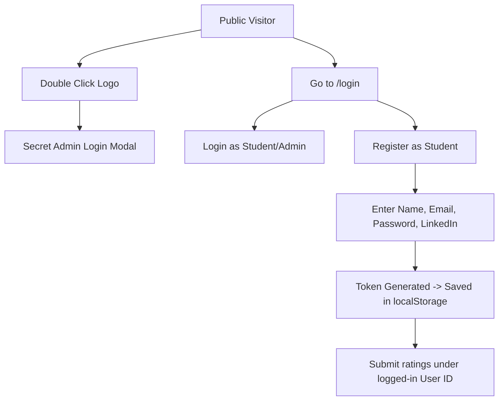
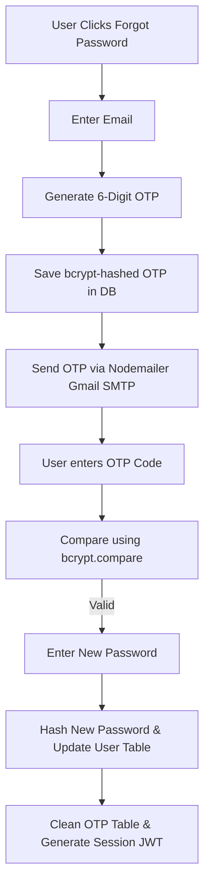
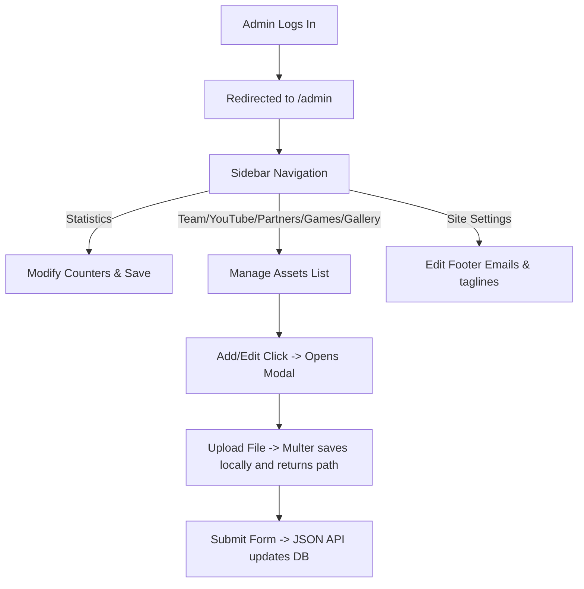

# Software Architecture Reverse-Engineering & Handover Report
**Project Name:** FCAI CUGD Club Portfolio Website
**Target Audience:** Senior AI Architect

---

## EXECUTIVE SUMMARY

### What the System Is
The **FCAI Cairo University Game Development (CUGD) Club Portfolio** is a premium, custom-built web platform designed to showcase the creative game designs, student training waves, community projects, and media highlights produced by Cairo University's premier game development student organization. It includes a high-fidelity, interactive public landing page and search workspace, along with a full-featured admin content management system (CMS) dashboard to update assets, statistics, team members, and settings.

### Why It Exists
The club requires a centralized showcase hub to display the student games completed in their training "waves," the official games published under the community team, and media clips (concept art, videos, and motion reels). Additionally, it gives the administrative board a self-managed backend to control stats, edit site text, and manage community relations (partners, social media links).

### Who Uses It
1. **Public Visitors / Students / Recruiters:** Browse community games, download or play them via itch.io, review media reels, view details on training waves, and submit interactive star ratings.
2. **Students / Members:** Create student profiles and upload their individual or group game entries completed during club training waves.
3. **Club Admins (Board Members / Media Leads):** Access the restricted admin dashboard (CMS) to manage statistics, update public partner lists, post youtube content, moderate student waves, insert gallery assets, and alter site configurations.

### Core Business Value
- **Talent Discovery:** Highlighting student achievements directly to recruiters and game studios.
- **Engagement Amplification:** Gamifying interaction with a seamless multi-auth rating system for both logged-in users and anonymous visitors.
- **Administrative Independence:** Empowering club leadership to update portfolios, text, and graphics dynamically without developer intervention.

---

## COMPLETE FEATURE INVENTORY

### 1. Dual-State Star Rating System
- **Purpose:** Enables both anonymous visitors and authenticated users to rate student projects, community games, and gallery media.
- **User Flow:** User hovers over stars (which scale and light up orange dynamically) -> clicks a rating -> the front-end performs optimistic rendering -> the back-end records the rating and calculates the new running average -> the card updates dynamically with the new average score.
- **Files Involved:**
  - `public/js/main.js` (`renderStars`, `submitRating`)
  - `public/js/projects.js` (Star click handlers for `community_game` and `student_project`)
  - `public/js/gallery.js` (Star click handlers for `gallery` items)
  - `server/routes/data.js` (`/rate` POST endpoint)
- **APIs Involved:** `POST /api/data/rate`
- **Database Entities:** `ratings`
- **Dependencies:** FontAwesome (star icons), local storage (for visitor tracking).

### 2. Scroll Reveal & Intersection Animation System
- **Purpose:** Delivers a premium, premium feel by triggering scroll animations as structural components enter the viewport.
- **User Flow:** User scrolls down the page -> elements fade-in and slide-up smoothly using CSS transitions -> the observer detaches after firing to optimize rendering performance.
- **Files Involved:**
  - `public/js/main.js` (`initScrollReveal`)
  - `public/css/style.css` (`.scroll-reveal`, `.scroll-reveal.visible`)
- **APIs/Database:** None.
- **Dependencies:** Vanilla Browser IntersectionObserver API.

### 3. Infinite Marquee YouTube Showcase
- **Purpose:** Display a rotating reel of YouTube video content from game jams and design pipelines.
- **User Flow:** Public loads the homepage -> a dynamic carousel of video thumbnails moves from right to left continuously -> hovering pauses or slows the carousel -> clicking a thumbnail redirects the user to the YouTube video.
- **Files Involved:**
  - `public/js/main.js` (`loadYouTubeThumbnails`, `initializeMarquee`)
  - `public/css/style.css` (Keyframe marquee animations)
  - `server/routes/data.js` (`/youtube` GET endpoint)
- **APIs Involved:** `GET /api/data/youtube`
- **Database Entities:** `youtube_videos`
- **Dependencies:** YouTube Image API (`https://img.youtube.com/vi/<id>/mqdefault.jpg`).

### 4. Interactive Media Lightbox
- **Purpose:** Full-screen immersive viewing of high-res image and video creations.
- **User Flow:** Visitor clicks a card in the Gallery -> screen dims and a modal pops up -> videos auto-play with audio and controls -> user can exit by clicking the overlay, close icon, or pressing the Escape key.
- **Files Involved:**
  - `public/gallery.html`
  - `public/js/gallery.js` (`openLightbox`, `closeLightbox`)
- **APIs/Database:** None.
- **Dependencies:** Vanilla DOM events, HTML5 Video player.

### 5. Multi-Form Auth and OTP Password Recovery
- **Purpose:** Registers/logs in users and allows self-service password recovery via a 6-digit email verification token.
- **User Flow:** User requests reset -> system checks database cooldown (1 min limit) -> generates a 6-digit pin -> hashes it with bcrypt and saves to DB (10 min expiry) -> sends verification email -> user inputs OTP (5 attempts max limit) -> password is changed -> user is logged in automatically.
- **Files Involved:**
  - `public/js/login.js` (Reset validation & transition logic)
  - `server/routes/auth.js` (`/forgot-password`, `/verify-otp`, `/reset-password`)
  - `server/utils/mailer.js` (Nodemailer setup)
- **APIs Involved:** `POST /api/auth/forgot-password`, `POST /api/auth/verify-otp`, `POST /api/auth/reset-password`
- **Database Entities:** `users`, `password_resets`
- **Dependencies:** `nodemailer`, `bcryptjs`, Gmail SMTP authentication.

### 6. Dynamic Content CMS (Admin Dashboard)
- **Purpose:** Full CRUD capabilities for all administrative collections.
- **User Flow:** Logged in admin accesses `/admin` -> sidebar toggles sections -> forms handle file uploads -> tables render content with edit/delete icons.
- **Files Involved:**
  - `public/admin.html`
  - `public/js/admin.js`
  - `server/routes/admin.js`
- **APIs Involved:** All endpoints under `/api/admin/*`
- **Database Entities:** All system tables.
- **Dependencies:** `multer` (multipart/form-data upload handler).

---

## USER JOURNEYS

### Visitor Journey


### Authentication & Self-Profile Management Journey


### Password Recovery Journey


### Administrator CMS Journey


---

## PAGE-BY-PAGE BREAKDOWN

### 1. Landing Page (`/` -> `public/index.html`)
- **Route:** `/`
- **Purpose:** Official homepage displaying hero introductions, active team members, YouTube videos, impact metrics, partners, and contacts.
- **Components Used:** Custom responsive navbar with dark theme toggle, interactive hero section with sound toggle, dynamic team layout grid, scrolling YouTube marquee, impact counters, and partner slider.
- **API Calls:**
  - `GET /api/data/team` (Renders board members)
  - `GET /api/data/statistics` (Sets metrics counters)
  - `GET /api/data/youtube` (Loads videos)
  - `GET /api/data/partners` (Renders sponsor logo slider)
  - `GET /api/data/site-settings` (Loads footer contact details)
- **State Dependencies:** Theme configuration (`localStorage.theme`), logged-in admin token (`localStorage.token`).
- **User Interactions:** Dark/light toggle, hero video sound mute/unmute, double-tap logo to trigger secret admin modal, scrolling through sections.

### 2. Showcase Page (`/projects` -> `public/projects.html`)
- **Route:** `/projects`
- **Purpose:** Public portal showing community game projects alongside student training wave outcomes.
- **Components Used:** Navbar with theme toggle, games display grid, tabbed wave switcher, star rating component.
- **API Calls:**
  - `GET /api/data/community-games` (Populates community catalog)
  - `GET /api/data/waves` (Fetches waves and nested projects)
  - `POST /api/data/rate` (Registers ratings)
- **State Dependencies:** Selected active tab (wave index), user credentials (`visitor_id` or `token`).
- **User Interactions:** Switching tabs, hover and rate games, play redirection (itch.io link).

### 3. Media Page (`/gallery` -> `public/gallery.html`)
- **Route:** `/gallery`
- **Purpose:** Showcases visual designs, posters, and short trailers produced by the club's media committee.
- **Components Used:** Gallery card grid, star rating wrappers, modal lightbox.
- **API Calls:**
  - `GET /api/data/gallery` (Loads gallery data)
  - `POST /api/data/rate` (Saves gallery item rating)
- **State Dependencies:** Open/closed lightbox state, user credentials.
- **User Interactions:** Hover over card, click star rating, click card to activate full-screen video/image lightbox.

### 4. Authentication Page (`/login` -> `public/login.html`)
- **Route:** `/login`
- **Purpose:** Unified interface for logins, user registrations, and self-service password resets.
- **Components Used:** Tab switcher, student registration form, company registration form, login form, recovery panel.
- **API Calls:**
  - `POST /api/auth/login`
  - `POST /api/auth/register/student`
  - `POST /api/auth/register/company` *(Note: Missing backend route)*
  - `POST /api/auth/forgot-password`
  - `POST /api/auth/verify-otp`
  - `POST /api/auth/reset-password`
- **State Dependencies:** Active panel name, local validation state.
- **User Interactions:** Form toggle links, toggle password visibility, submit registrations.

### 5. Control Panel (`/admin` -> `public/admin.html`)
- **Route:** `/admin`
- **Purpose:** Closed administration CMS for managing club content.
- **Components Used:** Sidebar nav, active page panel, edit popup modal, delete confirmation modal.
- **API Calls:**
  - `GET /api/auth/verify-admin` (Router check)
  - Full backend CRUD endpoints on `/api/admin/*`
  - `POST /api/admin/upload` (File uploads)
- **State Dependencies:** Current dashboard tab, edit item ID, upload paths, authentication token.
- **User Interactions:** Changing sections, adding elements, uploading files, editing data.

---

## COMPONENT MAP

### Global Navbar
- **Responsibility:** Handles page navigation, dark/light theme toggle, and checks auth state to conditionally display the Admin dashboard crown.
- **Parent:** Declared on all pages inside `<body>`.
- **Props/State:** Theme state (`localStorage.theme`), logged-in admin token (`localStorage.token`).
- **Dependencies:** FontAwesome CSS.

### Star Rating Component
- **Responsibility:** Renders the interactive feedback stars and handles rating submission.
- **Parent:** Injected inside game cards (`projects.js`), gallery items (`gallery.js`), and user dashboards.
- **Props/Data Inputs:**
  - `userRating`: Rating submitted by the current user.
  - `avgRating`: Running mean score.
  - `itemId`: DB target identifier.
  - `itemType`: Scope identifier (`project`, `community_game`, `student_project`, `gallery`).
- **Dependencies:** `window.renderStars` and `window.submitRating` from `main.js`.

### Immersive Media Lightbox
- **Responsibility:** Renders a full-screen media presentation.
- **Parent:** Injected globally in `gallery.html`.
- **Props/Data Inputs:** `item` object containing `{ media_type, src, title, description, creator_name }`.
- **Dependencies:** Standard HTML5 `<video>` and `` nodes.

### Content Sidebar Navigation
- **Responsibility:** Sidebar navigation controlling dashboard panels.
- **Parent:** Injected inside `admin.html`.
- **Dependencies:** `renderSection` function in `admin.js`.

---

## API MAP

### Public / Data Endpoints (`/api/data/*`)

| Method | Endpoint | Auth | Request Body / Query | Success Response | Business Purpose |
| :--- | :--- | :--- | :--- | :--- | :--- |
| **GET** | `/api/data/team` | None | None | `Array<TeamMember>` | Fetches active board list |
| **GET** | `/api/data/partners` | None | None | `Array<Partner>` | Fetches logo listing (order ASC) |
| **GET** | `/api/data/statistics` | None | None | `{ students_count, graduates_count, projects_count }` | Fetches impact statistics |
| **GET** | `/api/data/youtube` | None | None | `Array<YouTubeVideo>` | Fetches promotional video links |
| **GET** | `/api/data/site-settings` | None | None | `{ footer_email, footer_phone, ... }` | Fetches general layout settings |
| **GET** | `/api/data/gallery` | Optional | `visitor_id` (Query/Header) | `{ items: Array<GalleryItem> }` | Fetches image & video gallery items |
| **GET** | `/api/data/community-games` | Optional | `visitor_id` (Query/Header) | `Array<CommunityGame>` | Fetches community-built games list |
| **GET** | `/api/data/waves` | Optional | `visitor_id` (Query/Header) | `Array<Wave>` (with nested `projects`) | Fetches all waves and their projects |
| **POST**| `/api/data/rate` | Optional | `{ itemId, itemType, rating, visitor_id }` | `{ success: true }` | Registers user/visitor star rating |

---

### Authentication Endpoints (`/api/auth/*`)

| Method | Endpoint | Auth | Request Body | Success Response | Business Purpose |
| :--- | :--- | :--- | :--- | :--- | :--- |
| **POST** | `/api/auth/register/student` | None | `{ name, email, password, linkedin }` | `{ message, token, role, name }` | Registers student and sets token |
| **POST** | `/api/auth/login` | None | `{ email, password }` | `{ token, role, name, email }` | authenticates credentials and returns token |
| **GET**  | `/api/auth/profile` | Required | None (JWT token) | `User` profile data | Fetches active user data |
| **PUT**  | `/api/auth/profile` | Required | `{ name, linkedin, github, profile_image }` | Updated `User` profile | Saves user profile updates |
| **POST** | `/api/auth/profile/upload` | Required | `image` (Multipart/File) | `{ success: true, url }` | Saves profile image asset |
| **POST** | `/api/auth/forgot-password` | None | `{ email }` | `{ message: "OTP sent..." }` | Generates recovery OTP and emails it |
| **POST** | `/api/auth/verify-otp` | None | `{ email, otp }` | `{ success: true, message }` | Validates submitted recovery OTP |
| **POST** | `/api/auth/reset-password` | None | `{ email, otp, newPassword }` | `{ success: true, token, role }` | Saves new password & signs in user |
| **GET**  | `/api/auth/verify-admin` | Required | None (JWT token) | `{ ok: true }` | Validates admin role |

---

### Administrative Endpoints (`/api/admin/*`)
*All Administrative endpoints require a valid JWT header containing an `admin` role (`Authorization: Bearer <token>`).*

| Method | Endpoint | Request Body | Response | Business Purpose |
| :--- | :--- | :--- | :--- | :--- |
| **PUT** | `/api/admin/statistics` | `{ students_count, graduates_count, projects_count }` | `{ message: "Statistics updated" }` | Updates website stats |
| **POST** | `/api/admin/team` | `{ name, committee, linkedin, image, details }` | `{ id: lastID }` | Creates team member |
| **PUT** | `/api/admin/team/:id` | `{ name, committee, linkedin, image, details }` | `{ message: "Updated successfully" }` | Updates team member |
| **DELETE**| `/api/admin/team/:id` | None | `{ message: "Deleted successfully" }` | Removes team member |
| **POST** | `/api/admin/partners` | `{ name, logo_url, website_url, display_order }` | `{ id: lastID }` | Adds sponsor partner |
| **PUT** | `/api/admin/partners/:id` | `{ name, logo_url, website_url, display_order }` | `{ message: "Updated..." }` | Updates partner details |
| **DELETE**| `/api/admin/partners/:id` | None | `{ message: "Deleted..." }` | Removes partner |
| **POST** | `/api/admin/community-games` | `{ title, description, image, team, itch_url, display_order }` | `{ id: lastID }` | Adds community game |
| **PUT** | `/api/admin/community-games/:id`| `{ title, description, image, team, itch_url, display_order }` | `{ message: "Updated..." }` | Updates community game |
| **DELETE**| `/api/admin/community-games/:id`| None | `{ message: "Deleted..." }` | Removes community game |
| **POST** | `/api/admin/waves` | `{ name, number, description, display_order }` | `{ id: lastID }` | Creates training wave |
| **PUT** | `/api/admin/waves/:id` | `{ name, number, description, display_order }` | `{ message: "Updated..." }` | Updates wave details |
| **DELETE**| `/api/admin/waves/:id` | None | `{ message: "Deleted..." }` | Removes training wave |
| **POST** | `/api/admin/waves/:waveId/projects` | `{ title, description, image, team, itch_url, display_order }` | `{ id: lastID }` | Adds student project to wave |
| **PUT** | `/api/admin/waves/:waveId/projects/:id` | `{ title, description, image, team, itch_url, display_order }` | `{ message: "Updated..." }` | Updates wave student project |
| **DELETE**| `/api/admin/waves/:waveId/projects/:id` | None | `{ message: "Deleted..." }` | Removes student project |
| **POST** | `/api/admin/gallery` | `{ title, description, src, media_type, creator_name, display_order }` | `{ id: lastID }` | Creates media asset |
| **PUT** | `/api/admin/gallery/:id` | `{ title, description, src, media_type, creator_name, display_order }` | `{ message: "Updated..." }` | Updates media asset |
| **DELETE**| `/api/admin/gallery/:id` | None | `{ message: "Deleted..." }` | Removes media asset |
| **POST** | `/api/admin/youtube` | `{ title, youtube_url, thumbnail }` | `{ id: lastID }` | Adds video entry |
| **PUT** | `/api/admin/youtube/:id` | `{ title, youtube_url, thumbnail }` | `{ message: "Updated..." }` | Updates video details |
| **DELETE**| `/api/admin/youtube/:id` | None | `{ message: "Deleted..." }` | Removes video entry |
| **PUT** | `/api/admin/site-settings` | `{ footer_email, footer_phone, hero_tagline, ... }` | `{ message: "Site settings updated" }` | Updates page configurations |
| **POST** | `/api/admin/upload` | File (Multipart/form-data) | `{ success: true, url: "/uploads/..." }` | System-wide media upload helper |

---

## DATABASE KNOWLEDGE MAP

The database is built on **SQLite3** (`database/club.db`), managed by `database/db.js`. Below is the complete relational schema.

```mermaid
erDiagram
    users ||--o{ enrollments : "places"
    courses ||--o{ enrollments : "contains"
    waves ||--o{ student_projects : "organizes"
    
    users {
        INTEGER id PK
        TEXT name
        TEXT email UK
        TEXT password
        TEXT role
        TEXT linkedin
        TEXT github
        TEXT profile_image
        DATETIME created_at
    }

    enrollments {
        INTEGER id PK
        INTEGER user_id FK
        INTEGER course_id FK
        DATETIME enrolled_at
    }

    password_resets {
        INTEGER id PK
        TEXT email
        TEXT otp
        INTEGER attempts
        DATETIME expires_at
        DATETIME created_at
    }

    team_members {
        INTEGER id PK
        TEXT name
        TEXT committee
        TEXT linkedin
        TEXT image
        TEXT details
    }

    courses {
        INTEGER id PK
        TEXT title
        TEXT description
        TEXT image
        TEXT video
        TEXT creator
        DATETIME created_at
    }

    projects {
        INTEGER id PK
        TEXT title
        TEXT description
        TEXT image
        TEXT video
        TEXT team
        DATETIME created_at
        INTEGER user_id
    }

    gallery_items {
        INTEGER id PK
        TEXT title
        TEXT description
        TEXT src
        TEXT media_type
        INTEGER display_order
        TEXT creator_name
        DATETIME created_at
    }

    partners {
        INTEGER id PK
        TEXT name
        TEXT logo_url
        TEXT website_url
        INTEGER display_order
        DATETIME created_at
    }

    community_games {
        INTEGER id PK
        TEXT title
        TEXT description
        TEXT image
        TEXT team
        TEXT itch_url
        INTEGER display_order
        DATETIME created_at
    }

    waves {
        INTEGER id PK
        TEXT name
        INTEGER number
        TEXT description
        INTEGER display_order
        DATETIME created_at
    }

    student_projects {
        INTEGER id PK
        INTEGER wave_id FK
        TEXT title
        TEXT description
        TEXT image
        TEXT team
        TEXT itch_url
        INTEGER display_order
        DATETIME created_at
    }

    youtube_videos {
        INTEGER id PK
        TEXT title
        TEXT youtube_url
        TEXT thumbnail
        DATETIME created_at
    }

    site_settings {
        TEXT key PK
        TEXT value
    }

    statistics {
        INTEGER id PK
        INTEGER students_count
        INTEGER graduates_count
        INTEGER projects_count
        DATETIME updated_at
    }

    ratings {
        INTEGER id PK
        TEXT user_id
        INTEGER item_id
        TEXT item_type
        INTEGER rating
        DATETIME created_at
    }
```



### Table Schema and Constrains Specifications

1. **`users`:** Holds accounts for students and admins.
   - Constrains: `email` must be UNIQUE. `role` defaults to `'student'`.
2. **`enrollments`:** Maps students to training courses.
   - Constrains: UNIQUE composite on `(user_id, course_id)`. Cascades on deletion of user or course.
3. **`password_resets`:** Handles password recovery verification codes.
   - Holds the bcrypt hash of the verification OTP.
4. **`ratings`:** Holds ratings for all media assets.
   - Constrains: UNIQUE composite on `(user_id, item_id, item_type)`. This constraint is crucial as it powers the rating UPSERT statement: `ON CONFLICT(user_id, item_id, item_type) DO UPDATE SET rating = excluded.rating`.
5. **`student_projects`:** Completed project entries grouped by wave.
   - Constrains: `wave_id` links to `waves(id)` with ON DELETE CASCADE.

---

## BUSINESS LOGIC MAP

### 1. Anonymous and Authenticated Rating System
The rating engine parses identity signatures in a specific order:
1. Checked if logged in via Bearer token: returns `req.user.id`.
2. Checked if logged in via Body/Header: checks `req.body.visitor_id` or `req.headers['x-visitor-id']`.
3. If no identity is found, the request fails with a 400 error.
4. Score bounds: Must be an integer between 1 and 5 (`CHECK(rating >= 1 AND rating <= 5)`).
5. If the user rates the same item again, the system performs an upsert, updating the existing rating rather than creating a duplicate.

### 2. Password Recovery OTP Engine
- **Generation:** Generates a cryptographically random 6-digit integer pin.
- **Security Hashing:** The OTP is hashed using bcrypt before database insertion to prevent DB leak compromises.
- **Cooldown Lockout:** The system queries the newest entry in the `password_resets` table for the requesting email. If the elapsed time since creation is less than 60 seconds, the request is rejected with a 429 status.
- **Brute Force Lockout:** Each failed validation increments `attempts` by 1. Once `attempts >= 5`, the OTP record is locked out, requiring the user to request a new code.
- **Validity Expiration:** The OTP expires exactly 10 minutes after generation.
- **Data Privacy Protection:** To prevent email enumeration attacks, requests to `/api/auth/forgot-password` always return a generic success message ("If the email exists, an OTP has been sent"), regardless of whether the email is registered in the database.

---

## AUTHENTICATION & AUTHORIZATION

### Session Token Architecture
Sessions are managed via JWT. The token payloads consist of:
```json
{
  "id": 1,
  "role": "admin"
}
```
The secret key is configured via the `JWT_SECRET` environment variable.

### Authentication & Route Authorization Flow

```mermaid
sequenceDiagram
    participant C as Client
    participant M as Express App (app.js)
    participant R as Router Controller
    participant D as SQLite DB

    C->>M: Send Request to /api/admin/... (Header Auth: Bearer <JWT>)
    rect rgb(30, 30, 40)
        Note over M: Global authMiddleware
        M->>M: Verify token signature using JWT_SECRET
        alt is Valid Signature
            M->>M: Assign req.user = decoded
        else is Invalid / Missing
            M->>M: Assign req.user = null
        end
    end
    M->>R: Forward request
    rect rgb(40, 30, 30)
        Note over R: Route verifyToken middleware
        alt req.userRole == 'admin'
            R->>D: Run query/update
            D-->>R: Return database result
            R-->>C: Return JSON success response
        else Unauthorized
            R-->>C: Return 403 Forbidden / Access denied
        end
    end
```



---

## SYSTEM ARCHITECTURE

The application uses an **MVC/Layered Monolithic Architecture Style**.

```
┌────────────────────────────────────────────────────────┐
│                      FRONT-END                         │
│   HTML5 / CSS3 / Vanilla JS Page components            │
└──────────────────────────┬─────────────────────────────┘
                           │ HTTP REST Requests
                           ▼
┌────────────────────────────────────────────────────────┐
│                    EXPRESS SERVER                      │
│   App Entry Point (server/app.js)                      │
│   Global CORS & authMiddleware                         │
└──────────────────────────┬─────────────────────────────┘
                           │
         ┌─────────────────┴─────────────────┐
         ▼                                   ▼
┌──────────────────┐               ┌──────────────────┐
│  PUBLIC ROUTER   │               │   ADMIN ROUTER   │
│  (routes/data.js)│               │  (routes/admin.js)│
└────────┬─────────┘               └────────┬─────────┘
         │                                   │
         └─────────────────┬─────────────────┘
                           ▼
┌────────────────────────────────────────────────────────┐
│                   DATABASE CONTROLLER                  │
│   SQLite3 Verbose (database/db.js)                     │
└────────────────────────────────────────────────────────┘
```

---

## DEPENDENCY MAP

| Dependency | Purpose | Architecture Justification |
| :--- | :--- | :--- |
| `express` | Web Framework | Provides high-performance HTTP routing, middlewares, and static asset handling. |
| `sqlite3` | Relational Storage | Lightweight, file-based SQL database ideal for simple, self-contained monolithic deployments. |
| `bcryptjs` | Password Hashing | Secures user passwords and recovery codes via salt-hashing algorithms. |
| `jsonwebtoken` | Session Tokens | Standardized token protocol for stateless authentication. |
| `multer` | File Uploads | Robust parser for handling multipart/form-data, managing admin file uploads securely. |
| `nodemailer` | Email Deliverability| Handles SMTP mail delivery for verification and recovery codes. |
| `cors` | Network Security | Manages cross-origin resource sharing policies. |
| `dotenv` | Environment Config | Loads configurations and secrets from `.env` files. |
| `nodemon` | Development | Automatically restarts the Express server on code modifications. |

---

## CONFIGURATION KNOWLEDGE

The system relies on a `.env` configuration file located in the root directory:
```ini
PORT=3000
JWT_SECRET=your_super_secret_jwt_key
EMAIL_USER=fcaigamedevclub@gmail.com
EMAIL_PASS=your_gmail_app_password
```

### Server Dynamic Ports Logic
If the default `PORT` (e.g. 3000) is in use, the application captures `EADDRINUSE` and automatically requests a random free port (`server.listen(0)`) from the operating system:
```javascript
server.on('error', (e) => {
  if (e.code === 'EADDRINUSE') {
    console.log(`Port ${PORT} is in use, trying another dynamic port...`);
    setTimeout(() => {
      server.close();
      server.listen(0);
    }, 1000);
  }
});
```

---

## TECHNICAL DEBT & RISKS REPORT

> [!CAUTION]
> ### 1. Missing Company Registration Backend Route
> **Vulnerability:** The client-side Registration view contains a form to register as a "Company" (`registerCompanyForm`) which sends a POST request to `/api/auth/register/company`. However, **this route does not exist** in `server/routes/auth.js`. Submitting this form will result in a `404 Route Not Found` error.
> 
> **Impact:** Corporate partners/recruiters cannot register accounts on the platform.

> [!WARNING]
> ### 2. Missing `companies` Table & SQLite Query Crash
> **Vulnerability:** The login controller (`/api/auth/login`) is designed to check the `companies` table if the email is not found in the `users` table:
> ```javascript
> db.get('SELECT * FROM companies WHERE email = ?', [email], ...)
> ```
> However, **the `companies` table is never created** in `database/db.js`.
> 
> **Impact:** Logging in with an email that does not exist in `users` will trigger an SQLite error (`no such table: companies`), causing the request to crash.

> [!IMPORTANT]
> ### 3. File System Growth Risk
> **Vulnerability:** Multer uploads files directly to the local directory `../uploads`. There is no limit on file size, no automatic compression for image assets, and no background cleaner to delete orphaned assets when items are updated or deleted.
> 
> **Impact:** Disk space depletion over time.

---

## PROJECT RECONSTRUCTION GUIDE

If the entire codebase was deleted, you could rebuild it by following these steps:

### 1. Database Creation (`database/db.js`)
Install dependencies (`sqlite3`, `bcryptjs`) and instantiate the database connection. Define schemas for the fifteen tables: `users`, `enrollments`, `password_resets`, `team_members`, `courses`, `projects`, `gallery_items`, `partners`, `community_games`, `waves`, `student_projects`, `youtube_videos`, `site_settings`, `statistics`, and `ratings`. Seed default values for admin logins (`admin@admin.com` / `admin123`), initial metrics, social links, and demo gallery assets.

### 2. Main Entry Point (`server/app.js`)
Instantiate Express, enable JSON parsers (with a 10MB limits payload cap to allow encoded uploads), set up CORS, configure `/uploads` as a static assets folder, and implement `authMiddleware` globally on `/api` to decode JWTs and attach `req.user`. Include dynamic port fallbacks to assign `port 0` on `EADDRINUSE`.

### 3. Public API Layer (`server/routes/data.js`)
Build endpoints to fetch data lists (team, partners, site settings, youtube, statistics). Combine the retrieval of `waves` and their nested `student_projects` using standard subqueries to return average ratings and user-specific ratings based on either visitor IDs or authenticated user IDs.

### 4. Admin CMS Router (`server/routes/admin.js`)
Configure `multer` disk storage to write files to `/uploads`. Build CRUD routes for team members, youtube videos, partners, community games, waves, nested wave projects, site settings, and gallery items. Secure all routes with token verification middleware that validates `role === 'admin'`.

### 5. Frontend Client Assets (`public/*`)
Assemble vanilla HTML structures with dark mode themes. In `main.js`, build a dynamic CSS-injected confirmation modal, write client-side star rendering loops, implement IntersectionObservers for scroll reveal effects, and set up a secret admin trigger that opens the login modal when the navbar logo is double-clicked or double-tapped.

---

## AI HANDOVER SUMMARY

### 1. What the Project Does
It serves as the portfolio showcase and CMS platform for Cairo University's Game Development Club. It features an interactive student wave project tab deck, a media gallery with lightbox viewers, an infinite marquee carousel, and a rating engine.

### 2. Core Architecture
Built on a lightweight MVC monolithic stack using Node.js, Express, and SQLite3.

### 3. Secret Features
Double-clicking or double-tapping the nav logo opens a secret admin login panel (`admin@admin.com` / `admin123`), avoiding the need for public login links on the homepage.

### 4. Key Limitations
- Lacks a `companies` database table, causing the login flow to crash on non-existent emails.
- Lacks a backend route for company registrations.
- Local uploads can accumulate indefinitely, requiring an external cloud storage migration (e.g. AWS S3) in the future.

### 5. Recommendations for Next AI Agent
1. **Fix the login crash:** Create the `companies` table in `database/db.js` or clean up the fallback query in `server/routes/auth.js`.
2. **Implement Company Registration:** Add a `/register/company` endpoint in `auth.js`.
3. **Cloud Storage Migration:** Migrate local Multer file storage to S3 or Cloudinary.
